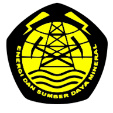

<!-- PROJECT LOGO -->
 

  
  <h3 align="center">Tekmirapedia</h3>

  

    this project is my task assignment to complete internship in Puslitbang Tekmira
  

<!-- ABOUT THE PROJECT -->
## About The Project

<table>
  <tr>
    <td></td>
    <td></td>
    <td></td>
  </tr>
 </table>

<!-- CONTRIBUTING -->
## Contributing

1. Fork the Project
2. Create your Feature Branch (`git checkout -b feature/AmazingFeature`)
3. Commit your Changes (`git commit -m 'Add some AmazingFeature'`)
4. Push to the Branch (`git push origin feature/AmazingFeature`)
5. Open a Pull Request

<!-- CONTACT -->
## Contact

Marwah - ahmadmarwah0@gmail.com